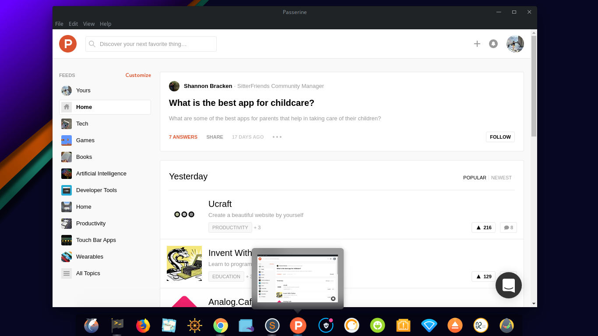
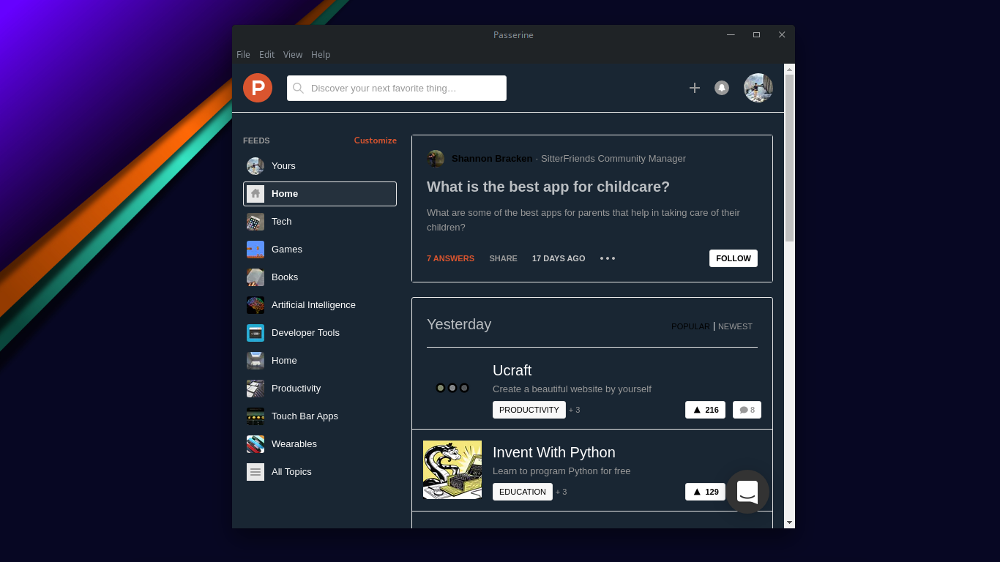

# Passerine  

> Product Hunt desktop app :rocket:

Passerine is a desktop version of Product Hunt :rocket:.

**[Website](https://aviary-apps.github.io/passerine)** &nbsp;&nbsp; **[Releases](https://github.com/aviary-apps/Passerine/releases)** 

<br>


<a href="https://github.com/aviary-apps/Passerine/releases/latest">
	
</a>


## Highlights

- [Dark theme](#dark-mode)
- [Always on Top](#always-on-top)


## Features

### Dark mode

You can toggle dark mode in the `View` menu or with <kbd>Cmd</kbd> <kbd>D</kbd> / <kbd>Ctrl</kbd> <kbd>D</kbd>.



### Always on Top

You can toggle whether Passerine stays on top of other windows in the `Window`/`View` menu or with <kbd>Cmd/Ctrl</kbd> <kbd>Shift</kbd> <kbd>t</kbd>.


### Keyboard shortcuts

Description            | Keys
-----------------------| -----------------------
Toggle "Dark mode"     | <kbd>Cmd/Ctrl</kbd> <kbd>d</kbd>
Toggle "Always on Top" | <kbd>Cmd/Ctrl</kbd> <kbd>Shift</kbd> <kbd>t</kbd>
Toggle window menu     | <kbd>Alt</kbd> *(Windows only)*

---


## Dev

Built with [Electron](https://electronjs.org).

### Run

```
$ npm install && npm start
```

### Build

See the [`electron-builder` docs](https://github.com/electron-userland/electron-builder/wiki/Multi-Platform-Build).


## Disclaimer

Passerine is a third-party app and is not affiliated with Product Hunt.

## Credits

- [Gautham Santhosh](http://github.com/gauthamzz) 
- [Aswin VB](http://github.com/aswinzz)
- [sindresorhus](https://github.com/sindresorhus/) and his project [caprine](https://github.com/sindresorhus/caprine)from which most of the Passerine, is insipred from.

## License

MIT
